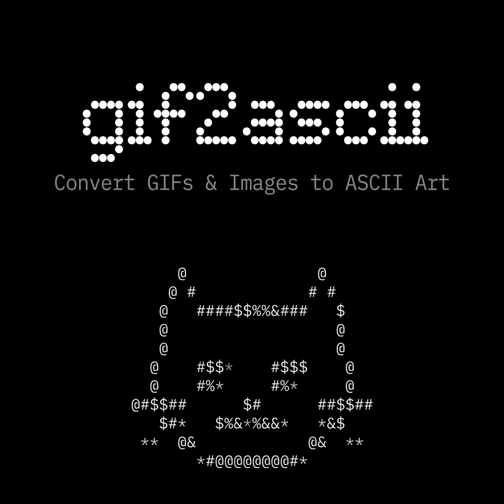
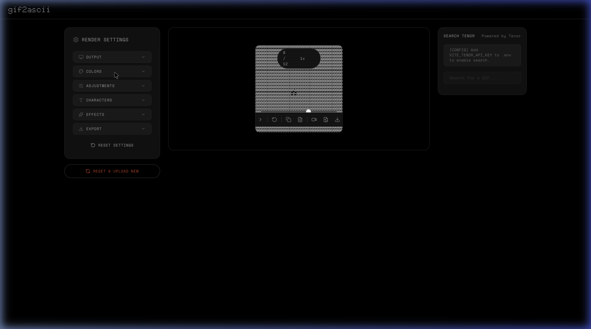

<div align="center">



[](LICENSE)
[](https://github.com/latentfidelity/gif2ascii/actions)

# gif2ascii

Convert GIFs and images to ASCII art with real-time preview, CRT effects, and multi-format export.

[Live Demo](https://latentfidelity.github.io/gif2ascii) · [Report Bug](https://github.com/latentfidelity/gif2ascii/issues)

</div>

---



## Features

- **Multi-format input** — GIF, PNG, JPEG, WebP with drag-and-drop or URL paste
- **13 character presets** — Standard, Dense, Blocks, Braille, Katakana, and more
- **Color modes** — Monochrome, source colors, custom palettes (CGA, Gameboy, Solarized, etc.)
- **Image adjustments** — Brightness, contrast, saturation, sharpness, dithering
- **CRT effects** — Scanlines, phosphor glow, chromatic aberration, noise, vignette, flicker
- **Animation effects** — Matrix rain, wave distortion, typing reveal
- **Export** — GIF, MP4/WebM video, PNG, HTML, ANSI (.ans)
- **Tenor integration** — Search and convert GIFs directly (requires API key)
- **Keyboard shortcuts** — Space (play/pause), Arrow keys (step frames), Home/End
- **CLI tool** — Terminal-based playback with ANSI colors and Sixel support

## Quick Start

```bash
npm install
npm run dev
```

Open http://localhost:3000

## CLI Usage

```bash
npm run build:cli
npm link
gif2ascii input.gif --source-color
```

See `gif2ascii --help` for all options.

## Environment Variables

For Tenor GIF search, create a `.env` file:

```
VITE_TENOR_API_KEY=your_tenor_key_here
```

## Tech Stack

| Layer | Technology |
|-------|-----------|
| Framework | React 19 + TypeScript |
| Build | Vite |
| Styling | Custom CSS (OLED Black design system) |
| Typography | Doto · Space Grotesk · Space Mono |
| GIF Decode | gifuct-js |
| GIF Encode | gifenc |
| Video Export | MediaRecorder API |
| Icons | Lucide React |

## License

[MIT](LICENSE)
